# quad
A quadcopter printed circuit board  

## How to use
Import .epro file at [https://pro.easyeda.com/editor](https://pro.easyeda.com/editor)

## Quickview

### FPGA
[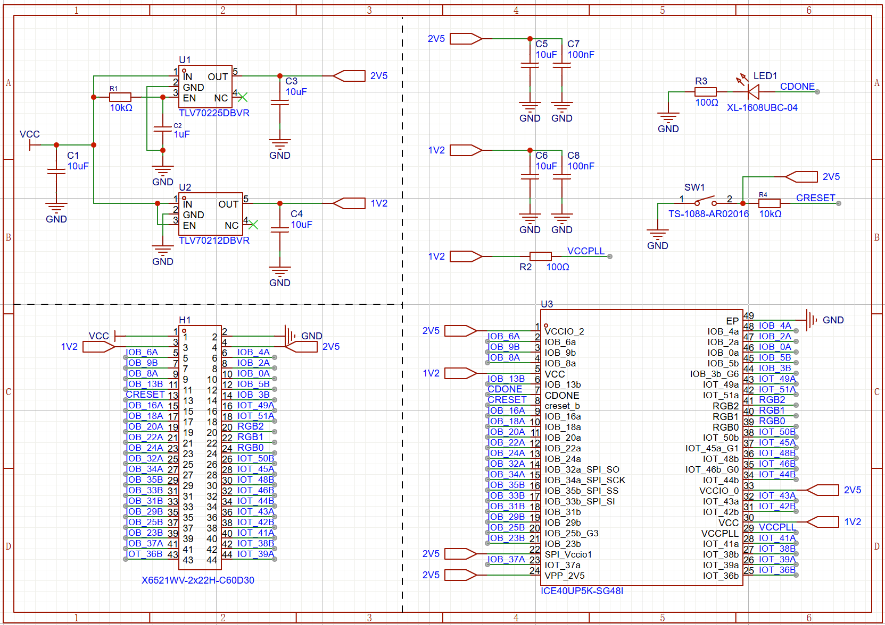](img/2025_08_20_fpga_sch.png)
[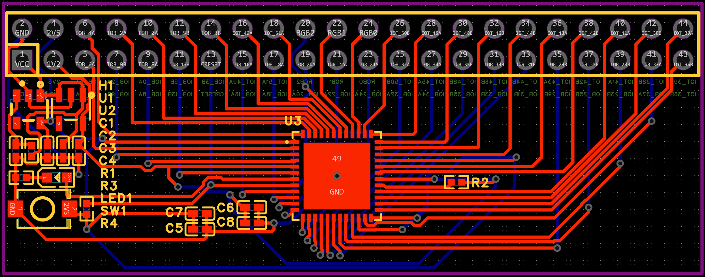](img/2025_08_20_fpga_pcb.png)

### BLDC
[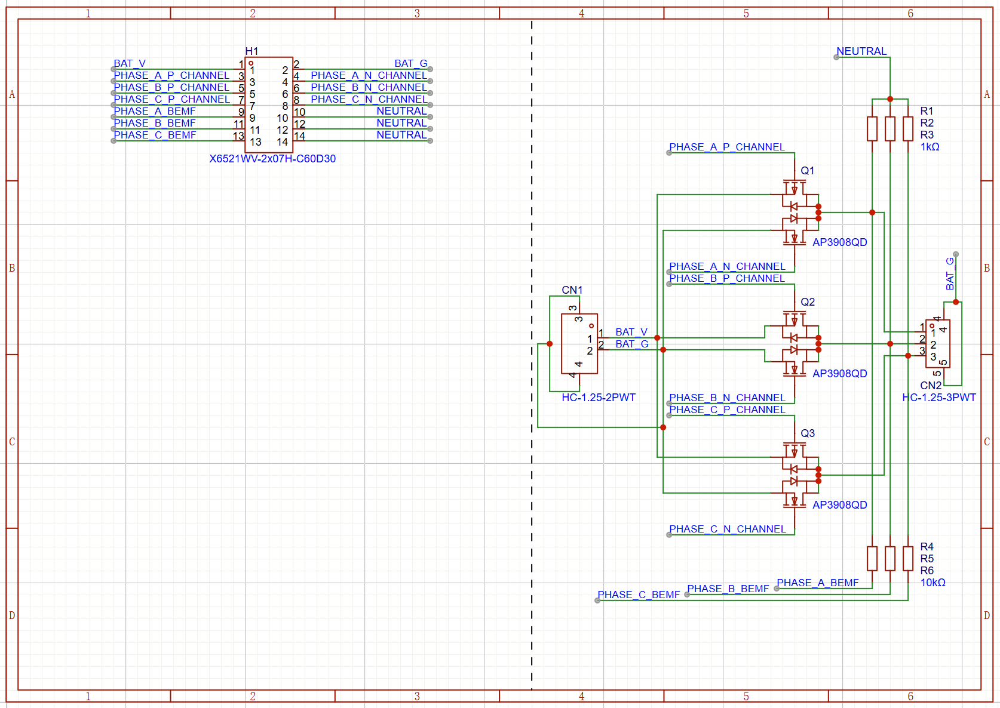](img/2025_07_18_bldc_sch.png)
[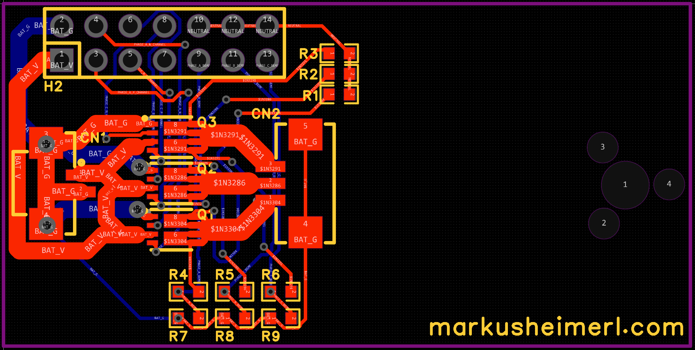](img/2025_07_18_bldc_pcb.png)

### Main Quad
<!-- [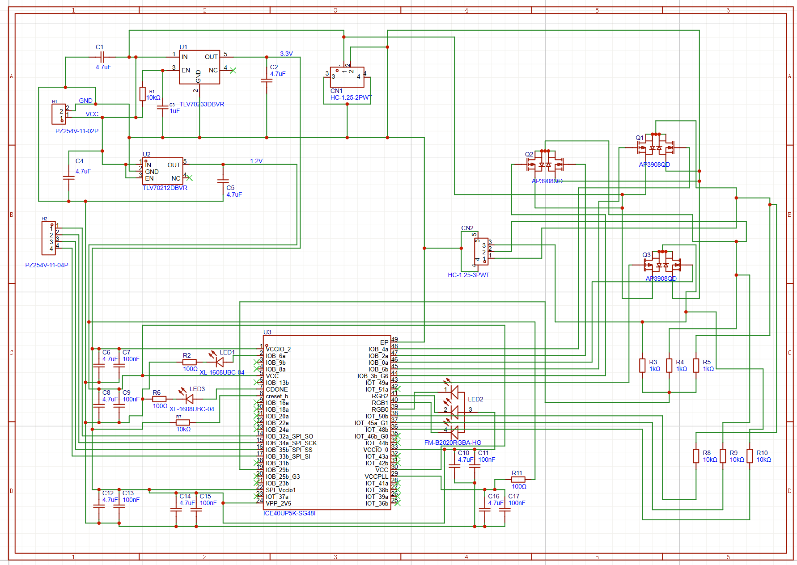](img/2025_06_05_quad_sch.png) -->
[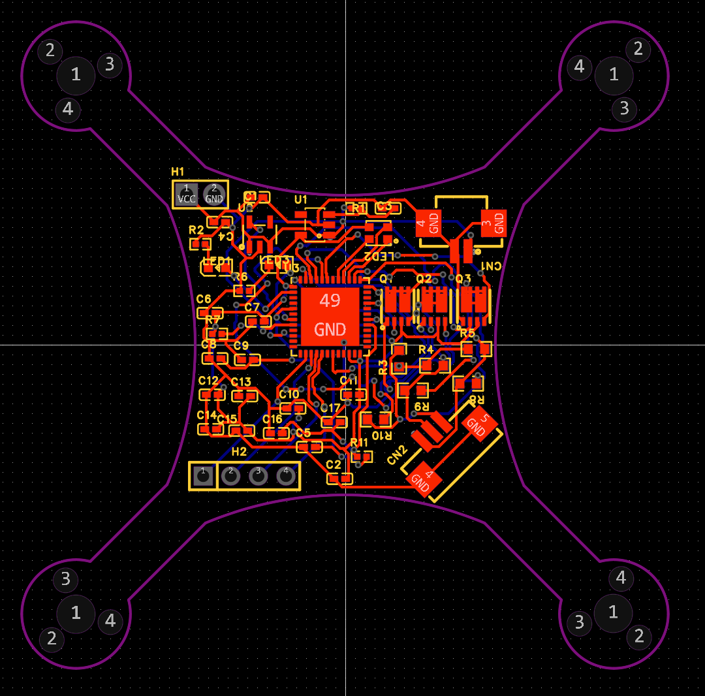](img/2025_06_05_quad_pcb.png)

### Camera
[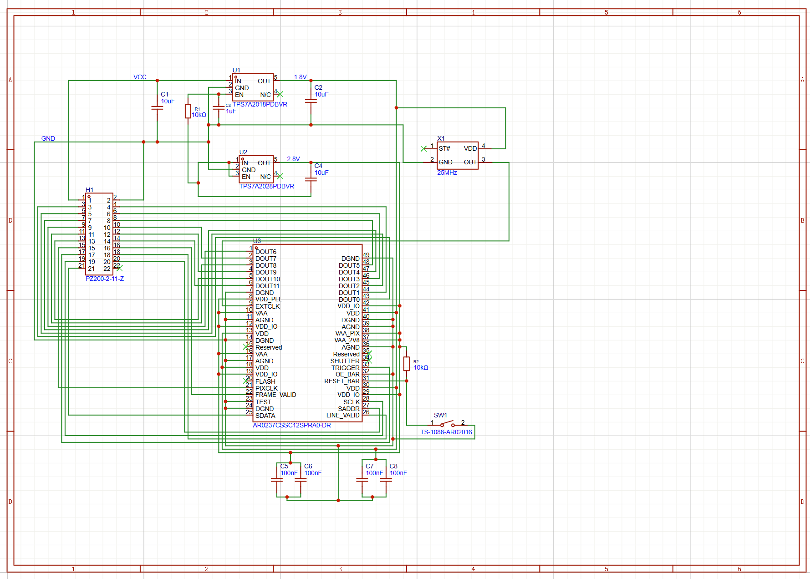](img/2025_06_24_cam_sch.png)
[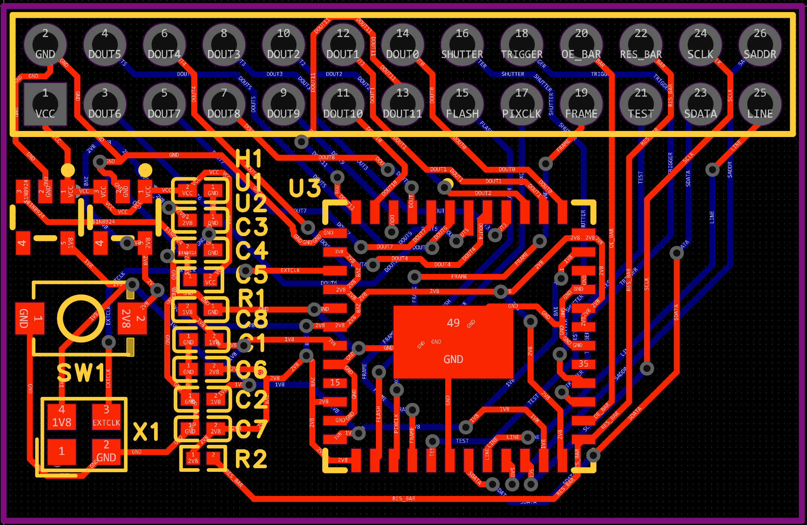](img/2025_06_24_cam_pcb.png)

### IMU
[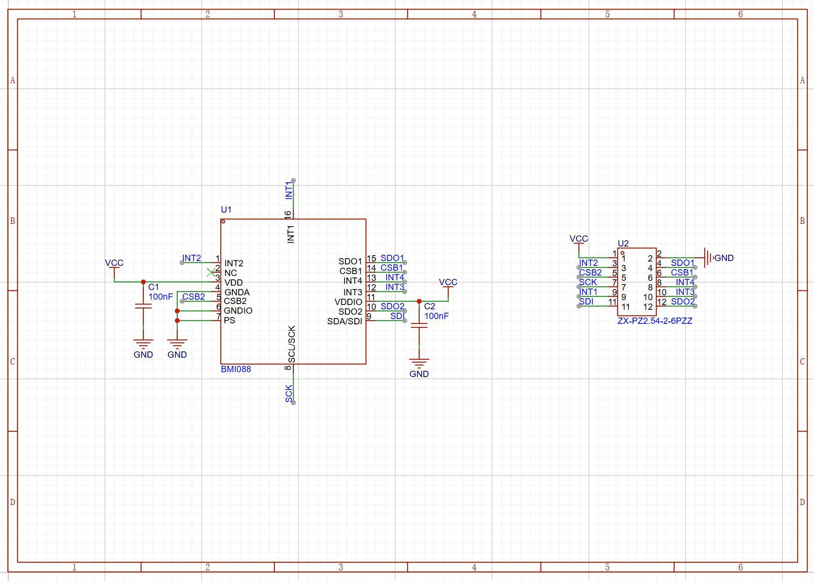](img/2025_07_18_imu_sch.png)

### FTDI
[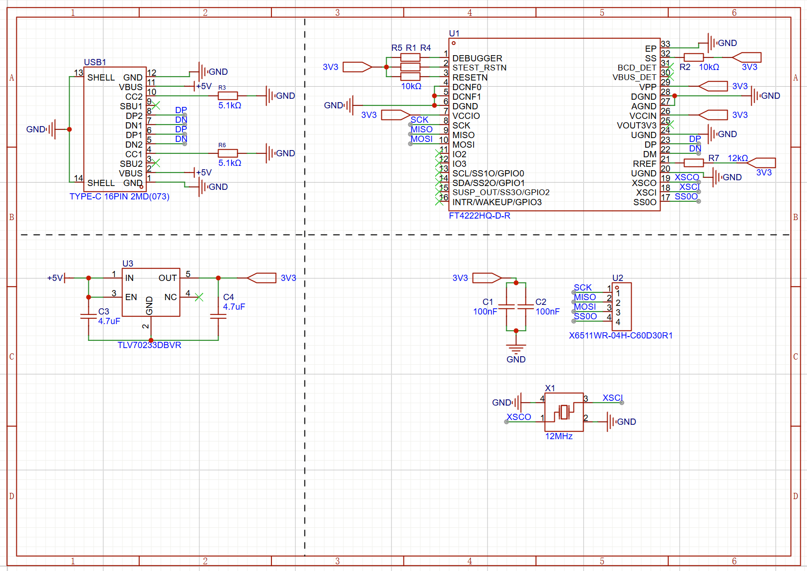](img/2025_07_18_ftdi_sch.png)
[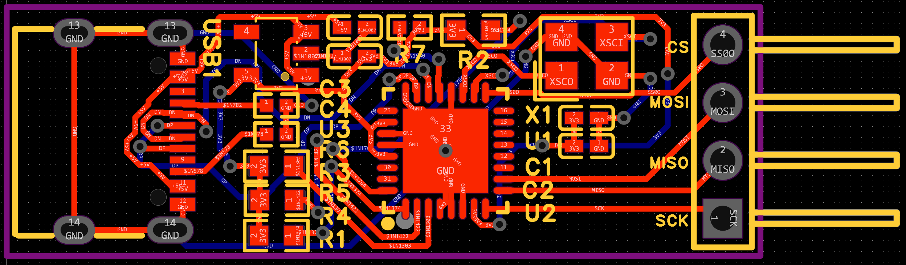](img/2025_07_18_ftdi_pcb.png)

### LEDs
[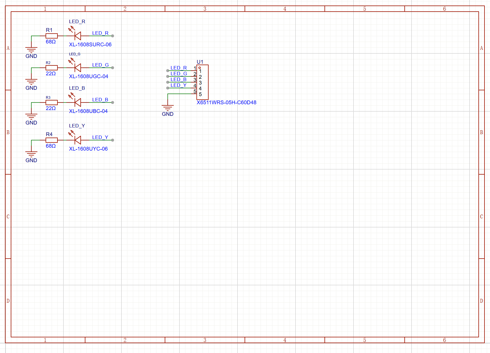](img/2025_08_24_leds_sch.png)

