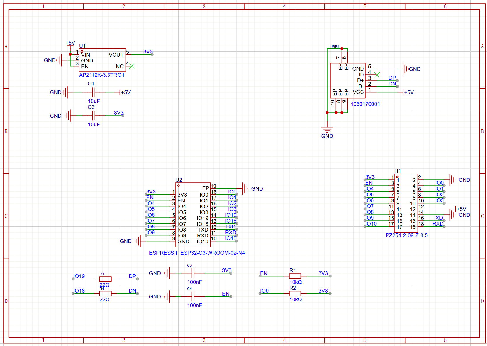
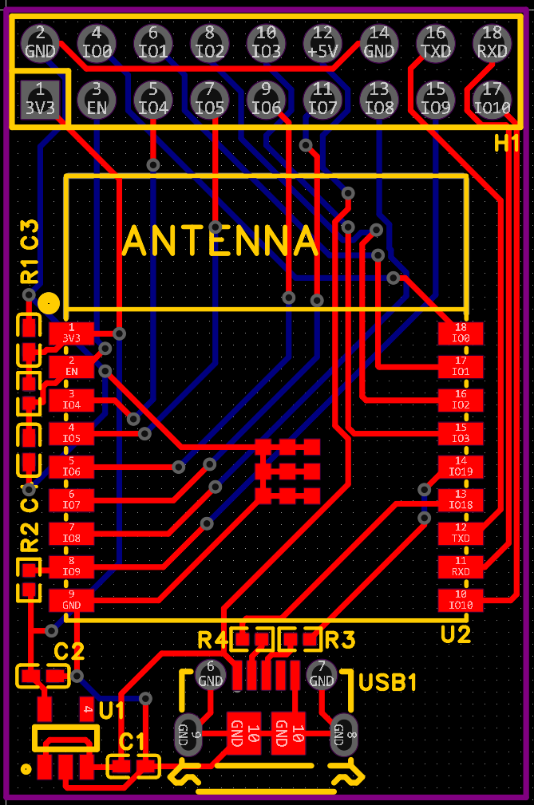
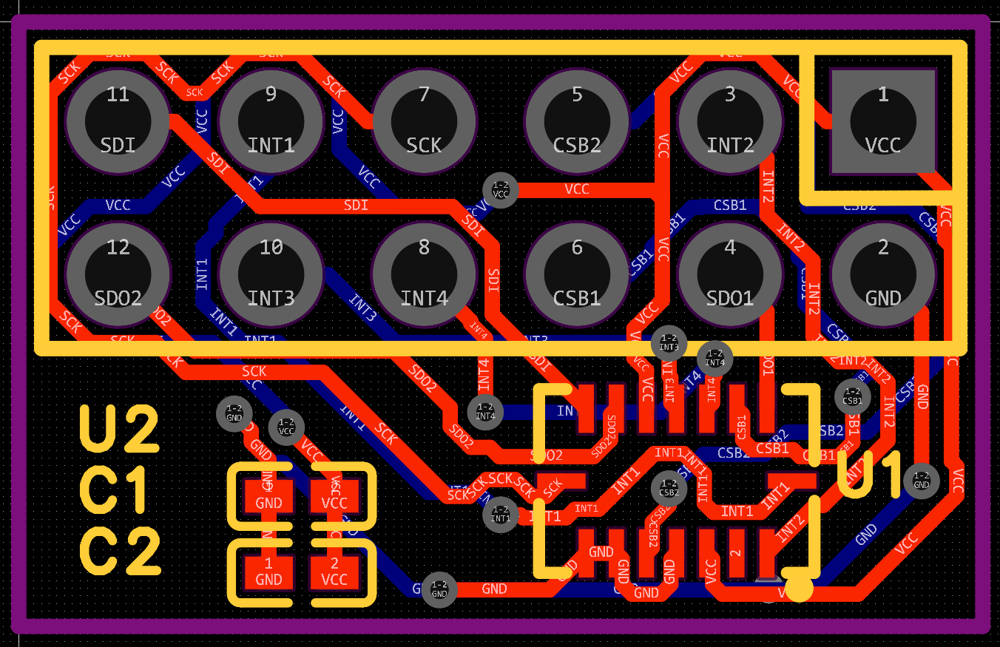
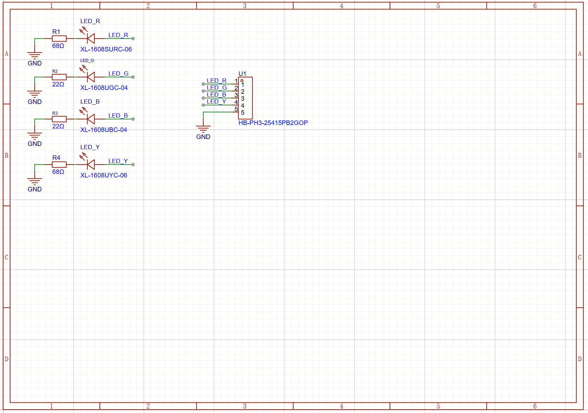
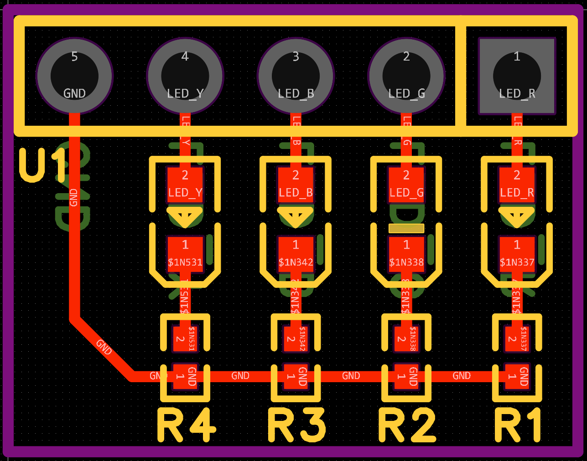

# quad
A quadcopter printed circuit board  

## How to use
Import .epro file at [https://pro.easyeda.com/editor](https://pro.easyeda.com/editor)

## Quickview

### ESP32

### USB2SPI

### FPGA

### DC

### IMU

### Flash

### LEDs

